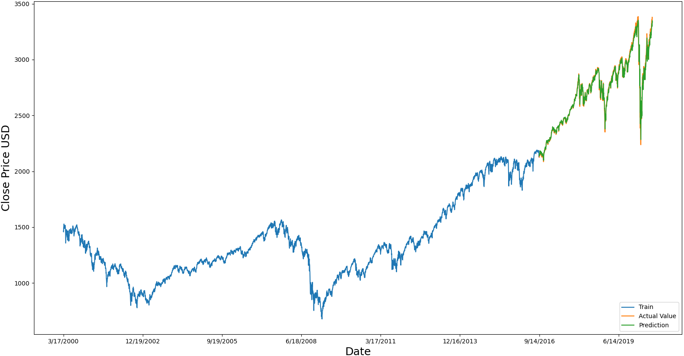
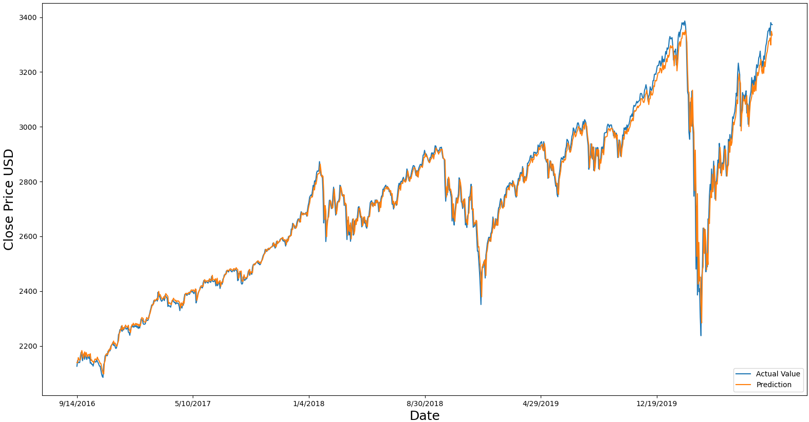

# Spylytics
Spylytics is a machine learning application that predicts the future price of various stocks based on the stock's previous prices. 

## Installation and Setup Instructions
Clone this repository.    
Install the following libraries:  
* tensorflow (20.2.2)  
* numpy  
* pandas  
* matplotlib  
* scikit-learn  

To start Spylytics:   
Run `Spylytics.py`  

## Conclusion
Spylytics is a machine learning application that predicts the future prices of various stocks based on the stock’s previous prices. Spylytics uses the previous fifty days of a stock’s price in order to predict the next day price. Spylytics’ TensorFlow model consists of two LSTM (long short-term memory) layers followed by a single twenty-five node dense layer and finally, a single node output layer.  The network was trained using S&P500 daily closing prices from 2000-01-03 to 2020-08-14. The loss function used to train the model is the ‘mean_squared_error’ function and loss value of the testing data was 1.81e-04.  

Below is an illustration of the training data, testing data, and actual values.

After achieving an appealingly low loss, I was interested to see how well model would perform on other stocks depending on the stock’s beta. A stock’s beta is a measurement of the stock’s volatility in relation to the overall market: https://www.investopedia.com/investing/beta-know-risk/. A beta greater than 1 suggests that the stock is more volatile than the broader market, and a beta less than 1 indicates a stock with lower volatility. A negative beta means that the stock tends moves in the opposite direction from the stock market. Stocks were chosen so that a variety of beta values could be tested, and the previous three years of the stock’s prices were tested. Below are the results of the stocks that were tested along with their current beta and loss.  

|                      | Ticker Symbol | Beta  | Loss     |
|----------------------|---------------|-------|----------|
| Beta = 1 (benchmark) |               |       |          |
|                      | S&P500        | 1     | 4.68e-04 |
| Beta < -1            |               |       |          |
|                      | AHPI          | -5.25 | 9.52e-04 |
|                      | ELTK          | -2.76 | 1.48e-03 |
| Beta ≈ -1            |               |       |          |
|                      | ZM            | -1.51 | 7.11e-04 |
|                      | DXR           | -1.02 | 7.61e-04 |
|                      | RKDA          | -0.82 | 5.61e-04 |
| Beta ≈ 0             |               |       |          |
|                      | AEY           | 0.04  | 6.52e-04 |
|                      | ADSW          | 0.27  | 5.69e-04 |
| Beta ≈ 1             |               |       |          |
|                      | NFLX          | 0.97  | 2.77e-04 |
|                      | ENPH          | 1.01  | 3.29e-04 |
|                      | ACN           | 1.02  | 3.27e-04 |
|                      | AAPL          | 1.23  | 1.24e-04 |
| Beta > 1             |               |       |          |
|                      | URI           | 2.40  | 5.74e-04 |
|                      | DXC           | 2.41  | 2.51e-04 |
|                      | RCL           | 2.57  | 4.62e-04 |

It is easy to see that stocks in certain beta ranges tended to perform better than others. Below is a table illustrating how the different beta ranges resulted in different average losses.  

| Beta | Average Loss |
|------|--------------|
| 1    | 4.68e-04     |
| < -1 | 1.22e-03     |
| ≈ -1 | 6.78e-04     |
| ≈ 0  | 6.10e-04     |
| ≈ 1  | 2.69e-04     |
| > 1  | 4.29e-04     | 

As expected, stocks with a beta close to 1 performed the best; however, these stocks performed surprisingly better than the S&P500. In addition, stocks with a beta greater than 1 also performed better than the S&P500. Stocks with a beta less than 1 performed worse and the loss continued to increase as beta decreased. Although this trend was expected, the loss of stocks with a beta less than -1 was unexpectedly high. I anticipated this loss to be closer to the loss correlated with a beta of -1, however, the loss was almost double that. I was concluded that Spylytics could perform exceptionally well on stocks with a beta of 1 or greater.  

This project helped me learn a lot about neural networks; more specifically, this was the first time I used LSTM layers and it was fascinating to learn about how they can be used to process sequences of data. In addition, compared to my previous experience with TensorFlow, this project was much different as I had to pre-process all the data myself, instead of relying on datasets created by third parties that are made specifically for neural networks. The hardest aspect of this project was all the trial and error that was involved. It took many tries to find a combination of layers, nodes and epochs that minimized the loss well. In the future I would want to improve this model by taking into account additional information such as previous volume as well as other indicators such as RSI (relative strength index) and MACD (moving average convergence divergence). I am excited to use what I have learned to implement other neural networks and to continue expanding my knowledge about machine learning.

